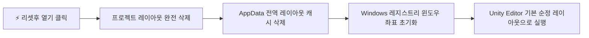

<div align="center">

  

  # Unity Hub Custom (Unity Hub+)
  
  **Unity Hub 프로젝트 관리 + Editor & Project 레이아웃 완전 초기화 실행기**

  [](https://microsoft.com/windows)
  [](https://dotnet.microsoft.com/)
  []()
  []()

</div>

---

## 📌 프로젝트 소개 (Overview)

**Unity Hub Custom**은 공식 Unity Hub의 핵심 기능(프로젝트 목록 관리, 설치된 Unity Editor 자동 감지 및 실행)을 제공하면서, 개발자들이 자주 겪는 **Unity Editor 레이아웃 깨짐 / 프리징 / 창 사라짐 문제**를 원클릭으로 해결하는 **[리셋후 열기 (Layout Reset & Open)]** 기능을 탑재한 독립 실행형 Windows 애플리케이션입니다.

> ### 💡 왜 '리셋후 열기'가 필요한가요?
> - 듀얼/트리플 모니터 환경 변경, 해상도 변경, Unity 버전 업그레이드 후 간헐적으로 **창이 화면 밖으로 벗어나거나 Inspector/Console 창이 검게 변하는 현상**이 발생합니다.
> - Unity는 창 배치를 프로젝트 내부(`UserSettings/Layouts`)와 사용자 PC 전역(`AppData`, `Registry`) 양쪽에 캐싱하므로, 둘 다 정리해주지 않으면 동일한 레이아웃 버그가 계속 재발합니다.
> - **Unity Hub Custom**은 버튼 한 번으로 두 영역의 레이아웃 캐시를 깨끗이 지우고 Unity를 초기 기본 상태(Factory Default)로 기동합니다.

---

## ✨ 주요 기능 비교

| 기능 | 공식 Unity Hub | Unity Hub Custom |
| :--- | :---: | :---: |
| **프로젝트 목록 관리 & 버전 감지** | ✅ | ✅ (기존 Hub 설정 자동 연동) |
| **설치된 에디터 자동 감지 (`Unity.exe`)** | ✅ | ✅ |
| **일반 프로젝트 열기 (`▶ 열기`)** | ✅ | ✅ |
| **⚡ 리셋후 열기 (레이아웃 완전 초기화)** | ❌ | **✅ (프로젝트 + 에디터 전역 초기화)** |
| **레이아웃 클린 삭제 (백업 없이 즉시 제거)** | ❌ | **✅ (UserSettings/Library 레이아웃 완전 정리)** |
| **초경량 독립 실행 파일** | ❌ (~200MB Electron) | **✅ (~500KB 단일 Exe, 무설치)** |

---

## ⚡ 레이아웃 초기화 (Reset) 상세 동작

`⚡ 리셋후 열기` 클릭 시 다음 작업이 순차적으로 안전하게 실행됩니다:



1. **프로젝트 레이아웃 (Project Layout) 초기화**:
   - `<ProjectRoot>\UserSettings\Layouts\*` (예: `default-2023.dwlt`) 삭제
   - `<ProjectRoot>\Library\CurrentLayout*.dwlt` 및 `CurrentMaximizeLayout.dwlt` 삭제
   - *(불필요한 백업 폴더 없이 바로 완전 삭제)*
2. **에디터 전역 레이아웃 (Editor Global Layout) 초기화**:
   - `%APPDATA%\Unity\Editor-5.x\Preferences\Layouts\current\*` 캐시 파일 삭제
3. **Windows 레지스트리 좌표 초기화**:
   - `HKCU\Software\Unity Technologies\Unity Editor 5.x` 레지스트리 키에서 다음 항목 초기화:
     - `UnityEditor.SaveWindowLayout*`
     - `RestoredMainWindowSize*`
     - `IsMainWindowMaximized*`
     - `UnityEditor.PopupWindow*`
4. **Unity Editor 기동**:
   - 해당 프로젝트에 매칭된 `Unity.exe`가 `-projectPath` 인자로 기동되어 완벽한 Default 레이아웃으로 열립니다.

---

## 🖥️ 화면 구성 및 탭 안내

- **프로젝트 탭 (Projects)**:
  - 등록된 Unity 프로젝트 목록 (프로젝트명, 경로, 버전 배지, 최종 수정일)
  - `▶ 열기` (일반 실행) 및 `⚡ 리셋후 열기` 버튼
  - 실시간 검색바 (프로젝트명 및 경로 필터링)
  - `+ 프로젝트 추가` 버튼 (폴더 선택 창)
  - 우측 `···` 버튼: 파일 탐색기에서 열기, 레이아웃만 초기화, 목록에서 제거
- **설치된 에디터 탭 (Installs)**:
  - 시스템에서 자동 감지된 Unity Editor 목록 (`C:\Program Files\Unity\Hub\Editor\*` 등)
  - `+ 에디터 수동 찾기` 버튼으로 사용자 지정 경로의 `Unity.exe` 등록 가능
- **설정 및 로그 탭 (Settings & Logs)**:
  - 초기화 항목별 On/Off 체크박스
  - Unity Hub 자동 동기화 On/Off
  - 실시간 작업 및 실행 활동 로그 뷰어

---

## 🚀 실행 및 빌드 방법

### 1. 프로그램 실행 (Run)
Windows 10 / 11 환경에서는 별도의 런타임 설치 없이 바로 실행 가능합니다.
- [`run.bat`](run.bat) 더블 클릭
- 또는 [`bin\Release\UnityHubCustom.exe`](bin/Release/UnityHubCustom.exe) 직접 실행

### 2. 소스 코드 빌드 (Build)
Visual Studio 2022(또는 MSBuild)가 설치된 환경에서 원클릭으로 빌드할 수 있습니다.
- [`build.bat`](build.bat) 더블 클릭
- 빌드 결과물은 `bin\Release\UnityHubCustom.exe`에 생성됩니다.

### 3. 윈도우 프로그램 등록 (Register / Install)
별도 설치 프로그램 없이도 원클릭으로 윈도우 정식 프로그램으로 등록할 수 있습니다.
- [`register.bat`](register.bat) 더블 클릭:
  - 시작 메뉴 및 Windows 검색창(`Win + S`)에 등록
  - Windows 설정의 [설치된 앱] 목록에 정식 프로그램으로 등록
  - `Win + R` 창에서 `UnityHubCustom`만 입력하여 즉시 실행 가능
- [`unregister.bat`](unregister.bat) 더블 클릭: 등록된 바로가기 및 레지스트리 깔끔하게 제거

---

## 📁 프로젝트 구조

```
UnityCustomHub/
├── app.ico                       # 고해상도 멀티 해상도 애플리케이션 아이콘 (16~256px)
├── app.png                       # 헤더 브랜드 로고 이미지
├── build.bat                     # 원클릭 MSBuild 컴파일 스크립트
├── run.bat                       # 원클릭 실행 스크립트
├── UnityHubCustom.sln            # Visual Studio 2022 솔루션 파일
├── UnityHubCustom.csproj         # WPF 프로젝트 설정 파일
├── App.xaml / App.xaml.cs        # 애플리케이션 리소스 및 테마 정의
├── MainWindow.xaml / .xaml.cs    # 메인 윈도우 UI 및 컨트롤 로직
├── Models/
│   ├── UnityProject.cs           # 프로젝트 데이터 모델
│   ├── UnityEditorInstall.cs     # 에디터 설치 정보 모델
│   └── AppSettings.cs            # 사용자 설정 모델
├── Services/
│   ├── UnityDetectionService.cs  # Unity.exe 에디터 자동 탐색 서비스
│   ├── ProjectService.cs         # 프로젝트 목록 로드 및 ProjectVersion.txt 파싱
│   ├── LayoutResetService.cs     # 프로젝트 및 에디터 전역 레이아웃 초기화 서비스
│   └── ProcessLauncherService.cs # Unity 프로세스 비동기 실행 서비스
├── Helpers/
│   ├── JsonHelper.cs             # 가벼운 JSON 직렬화/역직렬화 헬퍼
│   └── RelayCommand.cs           # MVVM Command 바인딩 헬퍼
└── Properties/
    └── AssemblyInfo.cs           # 어셈블리 버전 및 메타데이터
```

---

## 📄 라이선스 (License)

This project is licensed under the MIT License.
